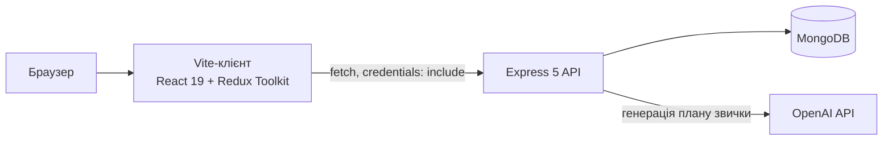
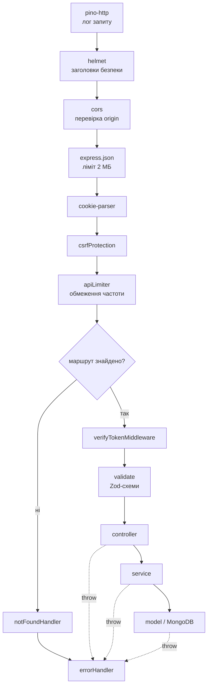
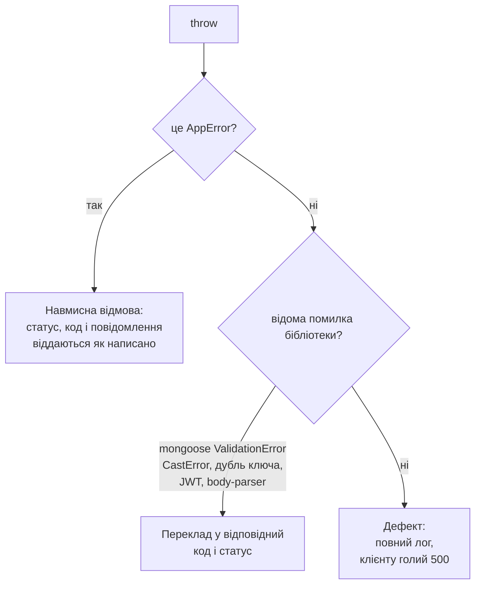
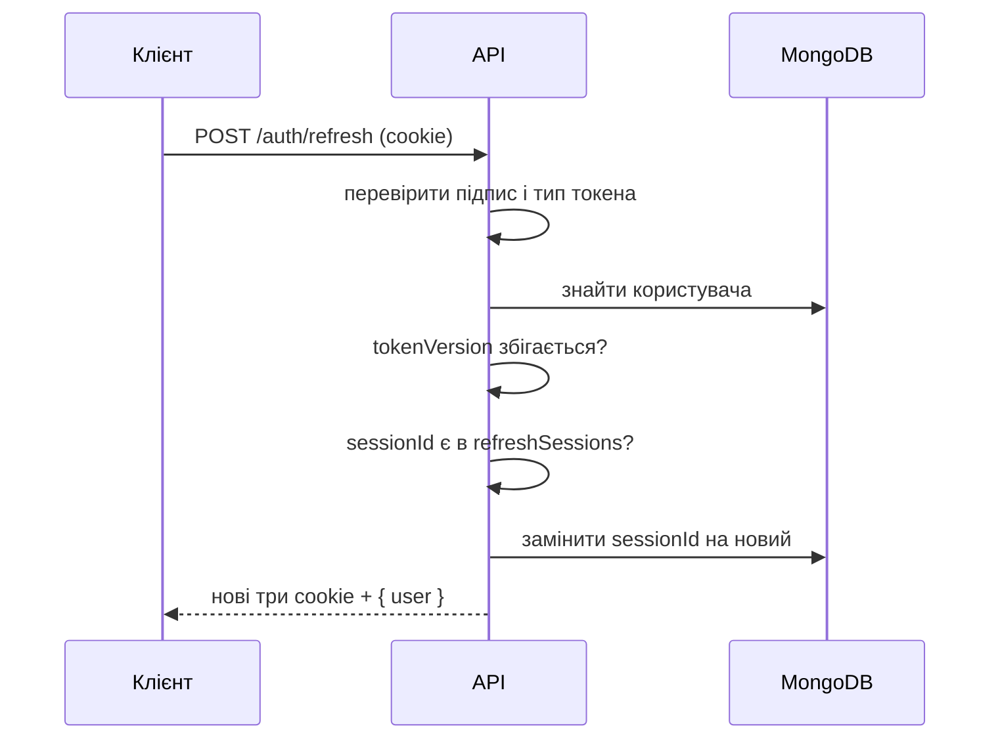
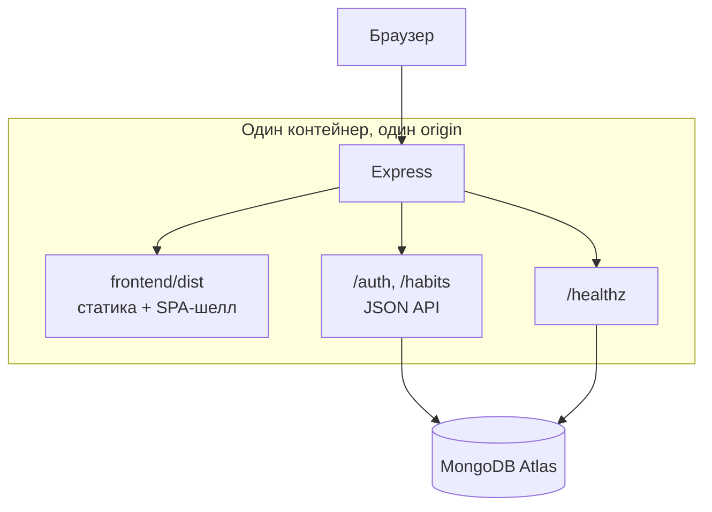

# Архітектура FocusPath

Документ пояснює, **чому** проєкт влаштований саме так. Що саме викликати —
у [`docs/API.md`](docs/API.md); як внести зміну — у
[`CONTRIBUTING.md`](CONTRIBUTING.md).

## Зміст

1. [Загальна картина](#загальна-картина)
2. [Життєвий цикл запиту](#життєвий-цикл-запиту)
3. [Конверт відповіді та обробка помилок](#конверт-відповіді-та-обробка-помилок)
4. [Шари на сервері](#шари-на-сервері)
5. [Сесії, токени та CSRF](#сесії-токени-та-csrf)
6. [Доменна модель звички](#доменна-модель-звички)
7. [Стан на клієнті](#стан-на-клієнті)
8. [Межа спільних типів](#межа-спільних-типів)

---

## Загальна картина



Два пакети розгортаються окремо, тому API — це справжній cross-origin сервіс,
а не бекенд, що віддає ту саму сторінку. Звідси майже все інше в цьому
документі: список дозволених origin, `crossOriginResourcePolicy` у helmet,
`credentials: 'include'` на кожному запиті й потреба в CSRF-токені.

Спільний `.env` лежить у корені. Vite читає його через `envDir`, сервер — через
явний `dotenv.config()` у `src/server.ts`. Одне джерело замість двох, які
розходяться.

---

## Життєвий цикл запиту

Порядок middleware в [`server/src/app.ts`](server/src/app.ts) не довільний.



Що тут важливо і чому:

- **`cookie-parser` перед `csrfProtection`.** CSRF-перевірка порівнює значення
  cookie із заголовком; без розібраних cookie порівнювати нічого.
- **CSRF перед будь-яким маршрутом, що змінює стан.** Інакше запит встиг би
  щось змінити до перевірки.
- **`notFoundHandler` і `errorHandler` — останні, саме в цьому порядку.**
  Запит, що не збігся з жодним маршрутом, стає `NotFoundError`, і далі його
  малює той самий обробник, що й будь-яку іншу помилку. Одна відповідь на всі
  випадки замість двох різних форматів.
- **`app.set('trust proxy', 1)`.** Деплой стоїть за одним проксі. Без цього
  рядка всі клієнти виглядали б для лімітерів як одна адреса проксі, і перший
  же активний користувач заблокував би решту.

---

## Конверт відповіді та обробка помилок

Кожна відповідь має одну з двох форм — тому клієнт має одну гілку, а не по
одній на маршрут:

```ts
{ success: true,  data: T }
{ success: false, error: { code, message, details? } }
```

Успіх формують `ok` / `created` з
[`utils/apiResponse.ts`](server/src/utils/apiResponse.ts). Невдачу — **тільки**
обробник помилок.

**Хендлери кидають і нічого не ловлять.** Express 5 сам передає відхилені
проміси в [`errorHandler`](server/src/middlewares/errorHandler.ts), тому в
контролерах немає жодного `try/catch`. Обробник ділить помилки на дві категорії:



Сенс поділу: клієнт ніколи не бачить внутрішнього стану чи стектрейсу, а все
неочікуване лишається помітним у логах, а не маскується під нормальну відмову.
Помилки з кодом 5xx логуються як `error` навіть коли їх кинули навмисно — це
все одно означає, що зламалося щось на нашому боці.

---

## Шари на сервері

```
routes/       оголошення маршрутів: middleware + схеми валідації
controllers/  тонкі: дістати userId, викликати сервіс, повернути ok/created
services/     бізнес-логіка, перевірка власника, робота з моделями
models/       схеми Mongoose, індекси, toJSON-трансформи
validation/   Zod-схеми — єдине джерело правди для типів DTO
```

**Перевірка власника живе в сервісах.** `requireOwnedHabit` у
[`habitService.ts`](server/src/services/habitService.ts) скоупить кожен пошук
за `userId`. Поки всі звернення йдуть через нього, «користувач A не дістане
звичку користувача B» — це властивість шару. Якби перевірка була в
контролерах, її треба було б пам'ятати в кожному новому ендпоінті, і рано чи
пізно хтось забув би.

**Zod-схеми породжують типи, а не навпаки.** Тип DTO — це `z.infer` зі схеми,
тому схема й тип не можуть розійтися. Побічний ефект, який виявився не менш
важливим за головний: вимога `z.string()` закриває NoSQL-ін'єкцію. Об'єкт-оператор
на кшталт `{"$ne": null}` не проходить перевірку типу задовго до того, як
дістанеться до запиту. `sanitizeFilter` у
[`config/mongoose.ts`](server/src/config/mongoose.ts) лишається другою лінією,
а не першою.

**Моделі зрізають власні секрети.** `toJSON`-трансформи в
[`User`](server/src/models/User.ts) і [`Habit`](server/src/models/Habit.ts)
видаляють `password`, `tokenVersion`, `refreshSessions`, `userId` і `__v`. Це
робиться один раз у моделі, а не в кожному контролері — тоді жоден контролер
не може про це забути.

---

## Сесії, токени та CSRF

### Чому cookie, а не localStorage

Токен у `localStorage` читається будь-яким скриптом на сторінці, тож одна
XSS-вразливість — і сесію можна винести. Тому access- і refresh-токени лежать у
**httpOnly** cookie: JavaScript до них не дістається взагалі.

Три cookie, які видає [`issueSession`](server/src/utils/cookies.ts):

| Cookie | httpOnly | Path | Час життя | Навіщо |
| --- | --- | --- | --- | --- |
| `access_token` | так | `/` | 15 хв | Автентифікація звичайних запитів |
| `refresh_token` | так | `/auth` | 7 днів | Обмін на нову сесію |
| `csrf_token` | **ні** | `/` | 7 днів | Клієнт повторює його в заголовку |

`refresh_token` навмисно обмежений шляхом `/auth`: браузер не чіпляє його до
звичайних викликів API, тому токен подорожує лише тоді, коли справді потрібен.

### Ротація та припинення сесій

Просто видавати новий refresh-токен — це ще не ротація: старий лишався б так
само дійсним. Тому в моделі користувача є два поля:

- **`refreshSessions`** — ідентифікатори прийнятих зараз refresh-токенів, по
  одному на пристрій. Використання токена замінює запис новим, вихід видаляє
  свій, і спроба скористатися вже витраченим токеном не проходить.
- **`tokenVersion`** — лічильник, який робить недійсними геть усі видані
  токени одразу. Зміна пароля піднімає його і чистить `refreshSessions`, тому
  чужі сесії завершуються негайно, а не доживають свої сім днів.



Ключі підпису для access і refresh — окремі
([`config/auth.ts`](server/src/config/auth.ts)). Токен одного типу й так не
можна відтворити як інший, бо тип записаний усередині й перевіряється, але
різні ключі обмежують наслідки витоку одного з них. Поза production обидва
падають назад на `JWT_SECRET` із попередженням у лозі; у production відсутність
окремого ключа — це помилка запуску.

### CSRF: double-submit

Стороння сторінка може змусити браузер надіслати наші cookie, але **не може їх
прочитати**. Тому `csrf_token` видається читабельним: клієнт зобов'язаний
повторити його в заголовку `X-CSRF-Token`, а зробити це здатна лише сторінка,
якій cookie доступна — тобто наша.

Запити **без жодної сесійної cookie пропускаються без перевірки**. Це не
послаблення: якщо сесії немає, немає й чого викрадати. Заразом це автоматично
звільняє вхід і реєстрацію, і не доводиться вести список винятків, який рано
чи пізно забудуть оновити.

Порівняння значень — через `timingSafeEqual`, з попередньою перевіркою довжини
(функція кидає на різних довжинах, і сама ця помилка вже була б відповіддю).

### Гонка при оновленні сесії

Сервер ротує refresh-токен при кожному використанні. Якби два запити, що
отримали 401, кинулися оновлювати сесію одночасно, той, хто програв гонку,
лишився б із уже витраченим токеном і вилетів би з застосунку.

[`client.ts`](frontend/src/api/client.ts) тримає єдиний `refreshInFlight`: усі
чекають на одну спробу. Після успіху запит повторюється рівно один раз
(`mayRetry`), тому невдале оновлення не перетворюється на нескінченний цикл.

---

## Доменна модель звички

**Розклад генерується наперед.** Створення звички одразу створює по одному
запису `dailyCompletions` на кожен день `duration`. Тому «чи виконано день N»
— це прочитати поле, а не порахувати щось із дат при кожному запиті.
Інваріант: `dailyCompletions.length === duration`.

Усі дати нормалізовані до **півночі UTC** (`startOfUtcDay` в
[`utils/dates.ts`](server/src/utils/dates.ts)). Без цього «сьогодні» залежало б
від часового поясу процесу, і той самий день міг би збігатися або не збігатися
залежно від того, де запущено сервер.

**Перепланування зберігає позицію в плані, а не дату.** `buildSchedule`
переносить наявні записи за їхнім індексом: «третій день мого плану» лишається
третім, навіть якщо старт зсунувся. Скорочення `duration` відкидає зайві дні,
збільшення — додає порожні.

**Підрахунок серії** ([`habitSchedule.ts`](server/src/services/habitSchedule.ts)):

- серія — це безперервний ряд виконаних днів, що закінчується найсвіжішим;
- ряд може закінчуватися **вчора**, і це все одно чинна серія: день не є
  провалом, поки він не завершився, тож користувач, який ще не відмітив
  сьогоднішній день, серії не втрачає;
- ряд, що обірвався раніше за вчора, дає нуль;
- майбутні дні ігноруються — відмітка дня, до якого життя ще не дійшло, не
  подовжує серію.

Функція чиста і приймає `now` параметром, тому поведінку можна перевірити
тестом, не чекаючи доби.

**`GET /habits/daily` не віддає весь розклад.** Агрегація відбирає звички,
чинні на потрібну дату, залишає з розкладу лише запис того дня (`dayInfo`) і
додає `completedCount` — скільки днів виконано за весь період. Інакше показ
одного дня тягнув би за собою всі інші 364.

---

## Стан на клієнті

Три зрізи Redux Toolkit:

| Зріз | Що тримає |
| --- | --- |
| `auth` | Поточний користувач і стан завантаження |
| `habit` | Список звичок і звички обраного дня |
| `calendar` | Обрана дата й видимий тиждень |

**Похідні значення йдуть через `createSelector`**
([`store/selectors.ts`](frontend/src/store/selectors.ts)), тому рахуються раз
на зміну, а не на кожен рендер кожного підписника. Прості селектори полів
навмисно не мемоїзовані: вони повертають шматок стану як є, і обгортка тільки
додала б витрат.

**Сесія не зберігається на клієнті.** При старті `App` просто питає
`GET /auth/me` — cookie браузер надішле сам. Відмова для гостя тут нормальний
шлях, а не помилка.

**Увесь мережевий шар — це `apiRequest`.** Він розгортає конверт (виклики
отримують `data` напряму), зводить усі способи впасти до одного `ApiError` і
робить прозоре оновлення сесії при 401.

**`makeStore(preloadedState)`** будує ізольований стор — тести беруть свіжий на
кожен випадок, тому стан не протікає між ними.

---

## Межа спільних типів

`shared/` містить **тільки `.d.ts`**. Це не стилістика, а обмеження з наслідком:
файли декларацій не можуть містити рантайм-коду і ніколи не компілюються.
Тому обидва пакети підключають спільні типи через аліас `@shared/*`, не
отримуючи ні кроку збірки, ні залежності під час виконання.

Наслідок, який варто пам'ятати: спільній **константі** тут не місце. Якщо
потрібне спільне значення, воно має жити в одному з пакетів або бути
продубльованим свідомо.

Серверні моделі виводять свої інтерфейси зі спільних типів через `Omit`,
перевизначаючи лише те, що справді відрізняється в сховищі — дати як `Date`,
ідентифікатори як `ObjectId`, плюс поля, яких у відповіді не буває взагалі
(`password`, `userId`). Тому контракт і сховище не можуть тихо розійтися.

### Аліаси шляхів

Аліаси оголошені окремо для компілятора, тестового раннера і збирача. Додати
новий треба **в усі відповідні місця одразу**:

| Пакет | Файли, що мають збігатися |
| --- | --- |
| server | `tsconfig.json` → `paths`, `jest.config.ts` → `moduleNameMapper` |
| frontend | `tsconfig.app.json` → `paths`, `vite.config.ts` → `resolve.alias` |

Серверна збірка додатково проганяє `tsc-alias`, бо сам `tsc` лишає аліаси в
згенерованому JS як є.


---

## Топологія розгортання

У розробці це дві програми на двох портах: Vite на 5173, API на 3000. У
продакшені — **один процес і один origin**: Express віддає і зібраний клієнт, і
API.



### Чому один origin, а не два сервіси — це не теорія

Спроба розгорнути клієнт і сервер як два окремі сервіси на Render
(`focuspath-web.onrender.com` + `focuspath-api.onrender.com`) була перевірена
на практиці й тримала застосунок непрацездатним: `GET /auth/me` повертав 401
(очікувано для гостя), але `POST /auth/refresh` — 403 `FORBIDDEN`, і вхід був
неможливий.

Причина структурна, а не помилка конфігурації:

- **`onrender.com` — публічний суфікс** (Public Suffix List), так само як
  `vercel.app` чи `github.io`. Це навмисне обмеження хостингу: воно не дає
  одному орендареві безкоштовного піддомену читати cookie іншого. Наслідок —
  `focuspath-web.onrender.com` і `focuspath-api.onrender.com` для браузера є
  двома цілком незнайомими сайтами, і поставити між ними спільну cookie
  неможливо жодним налаштуванням `SameSite` чи `CORS`.
- Навіть якби cookie якось долетіла, **CSRF-токен усе одно недосяжний**:
  `csrf_token` навмисно не httpOnly, щоб клієнтський `document.cookie` міг
  прочитати її і повторити в заголовку. Але `document.cookie` бачить лише
  cookie **свого** origin. Cookie видає API, читає її сторінка клієнта — два
  різні origin, тому JS фізично не бачить цю cookie ніколи.

Ця схема (два сервіси на спільному батьківському домені) цілком стандартна й
робоча — але тільки на **власному** домені, де можна поставити
`COOKIE_DOMAIN=.example.com`. На безкоштовних піддоменах хостингу вона не
працює в принципі, і саме тому тут — один origin, а не два сервіси.

Плюс цього підходу: **власний домен не потрібен**. Один хост не ділить cookie
ні з ким, тому статус `onrender.com` у Public Suffix List тут ні на що не
впливає — так само, як не впливає на будь-який інший односторінковий
застосунок.

### Порядок віддачі статики

Статика змонтована **перед лімітером частоти**. Одне відкриття сторінки тягне
документ, бандл, стилі й чотири файли шрифтів — рахувати їх проти бюджету
«300 запитів на 15 хвилин» означало б блокувати відвідувача після десятка
візитів.

SPA-фолбек, навпаки, стоїть **після маршрутів** і має запобіжники:

1. **Не чіпає шляхи API.** Інакше помилка в адресі ендпоінта поверталася б як
   200 з HTML, і клієнт — який чекає на конверт JSON — повідомив би про
   «нечитабельну відповідь» замість 404, який сервер насправді мав на увазі.
2. **Відповідає лише тим, хто просить `text/html`, крім кореня `/`.** Браузер
   при навігації це робить завжди, а `fetch` і XHR шлють `*/*`. Без цієї умови
   поведінка застосунку залежала б від того, чи лежить поруч збірка клієнта —
   і тести давали б різний результат локально та в CI. Корінь — виняток:
   health-checkeри й моніторинг доступності шлють `*/*` або взагалі без
   `Accept`, тож `/` віддається будь-кому.
3. **Приймає `GET` і `HEAD`.** Express сам мапить `HEAD` на `GET`-маршрути, але
   це окремий middleware з власною перевіркою методу. На першому реальному
   деплої `HEAD /` повертав 404, поки `GET /` віддавав 200 — рівно те, що
   виводить деплой з ротації здоровим інстансом.

`/healthz` існує окремо від `/` попри виняток вище — він додатково перевіряє
з'єднання з MongoDB, чого `/` не робить.

### Припущення, яке треба зняти перед масштабуванням

**Рейт-лімітери тримають лічильники в пам'яті процесу.** Поки інстанс один, це
коректно і навіть бажано — жодної зовнішньої залежності. Але щойно інстансів
стане кілька, «10 спроб входу за 15 хвилин» перетвориться на «10 × кількість
інстансів», і захист від перебору паролів тихо ослабне рівно в стільки ж разів.

Перед увімкненням масштабування лімітерам потрібне спільне сховище (Redis).
Це не про продуктивність, це про коректність.
